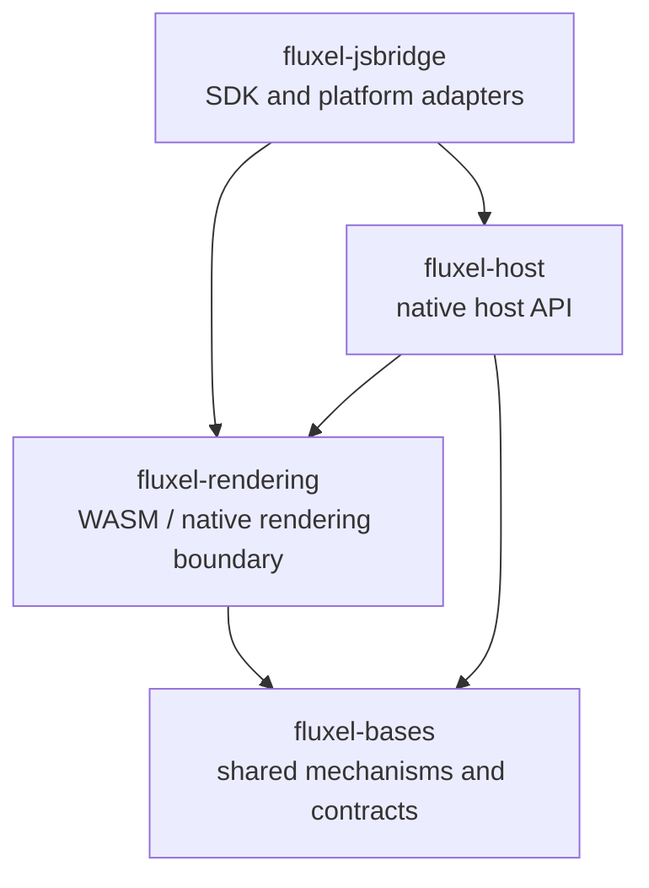

# Fluxel Ecosystem Architecture

Fluxel is organized as four existing monorepositories: `fluxel-bases`,
`fluxel-rendering`, `fluxel-host`, and `fluxel-jsbridge`. This map defines
their ownership and dependency direction. It does not authorize a crate merely
because an ownership location exists, or determine development order.

The roadmap remains demo-driven. A candidate crate is extracted only after its
boundary is demonstrated and reviewed. The repository boundary gives the
capability a stable home so application and AI work do not put it in an
unrelated layer.

## Dependency direction

An edge means the source may depend on the target when that capability exists;
it does not require any candidate crate to be created. `fluxel-bases` is a
leaf: it must not import rendering, host, JS SDK, or application policy. Data
and results may flow upward through typed APIs, callbacks, or owned values;
lower layers must not import higher-level policy.

`fluxel-jsbridge` is the default JavaScript SDK and integration layer, not the
semantic authority. A Rust, C#, Lua, or other language SDK may use the same
lower contracts without making JavaScript a dependency of those repositories.

## Library boundaries

Status has a precise planning meaning:

- **Existing:** implemented workspace crate and established ownership boundary.
- **Candidate:** likely to be exercised by a named roadmap stage, but extraction
  into a crate is not committed.
- **Unscheduled:** recognized possible ownership boundary with no planned stage
  or delivery commitment.

| Library | Repository | Status | Responsibility | Extraction gate |
| --- | --- | --- | --- | --- |
| `fluxel-rhi` | `fluxel-rendering` | Existing | GPU objects, commands, native synchronization, submission, readback, and backend realization | Existing workspace crate in `fluxel-rendering` |
| `fluxel-rendergraph` | `fluxel-rendering` | Existing | Single-frame pass declarations, resource dependencies, logical synchronization, portable execution plans, and validation | Existing workspace crate in `fluxel-rendering` |
| `fluxel-renderer` | `fluxel-rendering` | Existing | 3D submission, render packets, deterministic ordering, grouping, and lowering into RenderGraph | Existing workspace crate in `fluxel-rendering` |
| `fluxel-base` | `fluxel-bases` | Candidate | Small stateless shared types and utilities such as bytes, encoding, identifiers, hashing, and version or protocol values | More than one real consumer needs a coherent shared utility boundary |
| `fluxel-diagnostics` | `fluxel-bases` | Candidate | Structured diagnostic records, filtering, routing, and subscriptions | More than one layer needs shared diagnostics without a platform sink |
| `fluxel-assets` | `fluxel-bases` | Candidate | Durable asset identity, typed handles, generations, cross-frame references, loading state, cache/reuse policy, and safe release | A demo proves cross-frame identity, reuse, and retirement across consumers |
| `fluxel-loader` | `fluxel-bases` | Candidate | Loading state, deduplication, cancellation, failure, and CPU-data orchestration | A real loading path needs reusable policy independent of a platform reader |
| `fluxel-time` | `fluxel-bases` | Candidate | Portable time values, timers, timeouts, and fixed-update semantics | A host loop proves reusable timing semantics |
| `fluxel-input` | `fluxel-bases` | Candidate | Normalized keyboard, mouse, touch, wheel, and gamepad values and events | A playable or mobile demo proves shared input semantics |
| `fluxel-image` | `fluxel-bases` | Unscheduled | Owned pixel data and portable image codecs | Image behavior becomes reusable outside one loading path |
| `fluxel-render-assets` | `fluxel-rendering` | Candidate | GPU residency, upload, device-loss recreation, and frame-safe retirement for base asset identities | Rendering needs a reusable GPU-resource adapter |
| `fluxel-canvas` | `fluxel-rendering` | Candidate | Canvas-style 2D drawing semantics, including images, sprites, transforms, clipping, blending, ordering, text, and offscreen work | Stage 6 proves the Canvas boundary with one shared demo |
| `fluxel-shader` | `fluxel-rendering` | Unscheduled | Shader compilation, reflection, variants, and caching | Shader policy evolves independently from renderer submission |
| `fluxel-rendering-abi` | `fluxel-rendering` | Unscheduled | Stable native binary packaging for the rendering library | A concrete native embedder requires a versioned rendering boundary |
| `fluxel-rendering-wasm` | `fluxel-rendering` | Candidate | WASM packaging and exports for the rendering library | Stage 2 requires it for a supported browser and mini-game integration |
| `fluxel-platform` | `fluxel-host` | Candidate | Application startup, windows, screens, DPI, surfaces, resize, and host lifecycle | Stage 4 proves reusable host lifecycle independent of the demo |
| `fluxel-fs` | `fluxel-host` | Unscheduled | Platform file, directory, path, stream, and random-access I/O implementations | A host consumer needs it beyond local internals |
| `fluxel-storage` | `fluxel-host` | Unscheduled | Platform persistence for key-value data, JSON, blobs, and local storage | A real application requires persistent state on a named host |
| `fluxel-net` | `fluxel-host` | Unscheduled | Platform HTTP, WebSocket, download, and upload implementations | A real application provides an end-to-end networking consumer |
| `fluxel-audio` | `fluxel-host` | Unscheduled | Audio decoding, playback, volume, and output-device integration | A playable application requires audio on a named target |
| `fluxel-video` | `fluxel-host` | Unscheduled | Video decoding, playback, and texture delivery | A demonstrated host needs video on a named target |
| `fluxel-native-time` | `fluxel-host` | Unscheduled | OS clocks, timers, pacing, and sleep backing base time semantics | A host needs platform timing beyond local code |
| `fluxel-native-input` | `fluxel-host` | Unscheduled | OS input acquisition and translation to base input values | A named native host proves reusable input mapping |
| `fluxel-diagnostic-sinks` | `fluxel-host` | Unscheduled | Native diagnostic outputs such as console, files, ETW, logcat, and `os_log` | More than one native host needs shared sink policy |
| `fluxel-vm-js` | `fluxel-host` | Unscheduled | JavaScript VM integration for selected native hosts | A selected host requires VM-independent runtime integration |
| `fluxel-native-bridge` | `fluxel-host` | Unscheduled | Native bindings that expose host services to a language runtime | A selected native language host requires a reusable bridge |
| `fluxel-js-sdk` | `fluxel-jsbridge` | Unscheduled | Developer-facing JavaScript API that composes rendering and host capabilities | A real JavaScript application validates one supported public path |
| `fluxel-adapter-browser` | `fluxel-jsbridge` | Candidate | Browser APIs, WASM loading, and browser diagnostic sinks | Stage 2 proves a named browser target |
| `fluxel-adapter-minigame` | `fluxel-jsbridge` | Candidate | Selected mini-game APIs and platform adaptation | Stage 2 proves one explicitly selected mini-game host on a device |
| `fluxel-adapter-native` | `fluxel-jsbridge` | Unscheduled | JavaScript adaptation over native-host bridge contracts | A native host exposes a JavaScript SDK path |
| `fluxel-ui` | `fluxel-rendering` | Unscheduled | Purpose-built declarative UI over rendering and prepared resources | A later consumer demonstrates reusable declarative UI beyond the Stage 7 screen |

## Relationship rules

- `fluxel-bases` owns shared mechanisms, not a catch-all layer. Its assets own
  identity, typed handles, generations, references, loading state, reuse policy,
  and safe release; they do not create GPU textures or import rendering.
- Rendering owns GPU realization. A rendering asset adapter may turn base asset
  identity and loaded bytes into GPU residency, upload, recreation, and
  retirement without moving shared identity into RHI.
- Diagnostics schema, filtering, and routing belong in `fluxel-bases`.
  Rendering and host code emit structured records; native sinks belong in
  `fluxel-host`, while browser and mini-game sinks belong in `fluxel-jsbridge`.
- Base input and time define portable values and semantics. `fluxel-host` and
  `fluxel-jsbridge` acquire platform events and clocks, then translate them to
  those contracts.
- `fluxel-platform` owns OS event pumping, windows, surfaces, resize, and host
  lifecycle. It supplies the native surface handle RHI needs, but RHI owns only
  the GPU use and lifetime contract of that received handle.
- `fluxel-rhi` owns native barriers, queues, fences, commands, submission, and
  readback. RHI realizes portable RenderGraph contracts; RenderGraph does not
  import RHI or implement native synchronization.
- `fluxel-renderer` and `fluxel-canvas` consume RenderGraph and prepared
  resources. They do not own platform I/O, application lifecycle, or the
  cross-platform asset identity model.
- `fluxel-host` produces native executable artifacts such as EXE, APK/AAB, and
  IPA, and may link or load `fluxel-rendering`. `fluxel-rendering` produces
  embeddable WASM and native rendering libraries; it owns no main loop, input,
  filesystem, networking, storage, audio, or video.
- `fluxel-jsbridge` presents a unified JavaScript experience over browser,
  mini-game, and native-host APIs. It may organize loading and diagnostic
  subscription, but must not redefine rendering or host semantics.
- `fluxel-ui` may study declarative UI ergonomics but is not Vue-compatible,
  does not create `vue-native`, and does not introduce DOM or CSS contracts into
  the native core.

## Explicit exclusions

This ownership map does not commit Fluxel to creating every listed crate. It
does not authorize a Three.js backend, full Three.js compatibility,
`threejs-native`, Vue compatibility, or `vue-native`. Stage work remains
limited by [ROADMAP.md](ROADMAP.md),
[DEVELOPMENT_PRINCIPLES.md](DEVELOPMENT_PRINCIPLES.md), and
[EVIDENCE_POLICY.md](EVIDENCE_POLICY.md).
