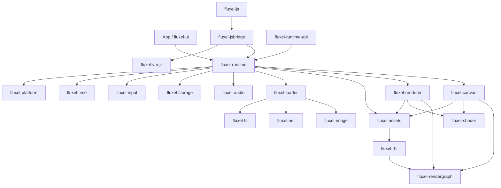

# Fluxel Ecosystem Architecture

This map defines expected ownership and dependency direction. It does not
authorize repository creation or determine development order.

The roadmap remains demo-driven. A candidate becomes a repository or crate only
after its extraction gate is demonstrated and its boundary is reviewed. Until
then, the name reserves an expected ownership location so application and AI
work do not place the responsibility in an unrelated library.

## Dependency direction

An edge means the source may depend on the target when that capability exists;
it does not require either candidate library to be created. `fluxel-base` is
omitted from the graph because it is a cross-cutting leaf boundary that may be
used only by demonstrated consumers. Data and results may flow upward through
typed APIs, callbacks, or owned values; lower layers must not import
higher-level application policy.

## Library boundaries

Status has a precise planning meaning:

- **Existing:** implemented workspace crate and established ownership boundary.
- **Candidate:** likely to be exercised by a named roadmap stage, but extraction
  into a crate or repository is not committed.
- **Unscheduled:** recognized possible ownership boundary with no planned stage
  or delivery commitment.

| Library | Status | Responsibility | Extraction gate |
| --- | --- | --- | --- |
| `fluxel-rhi` | Existing | GPU objects, commands, native synchronization, submission, readback, and backend realization | Existing workspace crate in the `fluxel-renderer` repository |
| `fluxel-rendergraph` | Existing | Single-frame pass declarations, resource dependencies, logical synchronization, portable execution plans, and validation | Existing workspace crate in the `fluxel-renderer` repository |
| `fluxel-renderer` | Existing | 3D submission, render packets, deterministic ordering, grouping, and lowering into RenderGraph | Existing workspace crate in the `fluxel-renderer` repository |
| `fluxel-platform` | Candidate | Application startup, windows, screens, DPI, surfaces, resize, and host lifecycle | Stage 4 proves reusable host lifecycle independent of the demo; additional hosts validate portability |
| `fluxel-loader` | Candidate | Obtain and decode CPU data from memory, files, URLs, and selected formats | Stage 4 introduces a real loading path used by the playable demo |
| `fluxel-assets` | Candidate | Durable resource identity, typed handles, generations, cross-frame references, residency, cache/reuse, and safe release | Stage 4 proves cross-frame identity, reuse, and retirement |
| `fluxel-time` | Candidate | Clocks, frame timing, timers, timeouts, and fixed-update timing | Stage 4 needs reusable timing beyond its host loop |
| `fluxel-input` | Candidate | Keyboard, mouse, touch, wheel, and gamepad input values and event translation | A playable or mobile demo proves shared input semantics |
| `fluxel-runtime` | Candidate | Compose platform, time, input, assets, loading, and rendering into a running application | The Stage 4 Windows playable demo proves a stable composition boundary |
| `fluxel-canvas` | Candidate | Canvas-style 2D drawing semantics, including images, sprites, transforms, clipping, blending, ordering, text, and offscreen work | Stage 6 proves the Canvas boundary with one shared demo |
| `fluxel-shader` | Unscheduled | Shader compilation, reflection, variants, and caching | Shader compilation, reflection, variant, or cache policy evolves independently from renderer submission |
| `fluxel-base` | Unscheduled | Small stateless cross-platform utilities such as encoding, hashing, and byte or string helpers | More than one real consumer needs a coherent shared utility boundary |
| `fluxel-fs` | Unscheduled | Files, directories, paths, streams, and random-access I/O | A runtime consumer needs a portable filesystem contract beyond loader internals |
| `fluxel-storage` | Unscheduled | Application persistence for key-value data, JSON, blobs, and local storage | A real application requires persistent state across supported hosts |
| `fluxel-net` | Unscheduled | HTTP, WebSocket, download, and upload capabilities | A real application provides an end-to-end networking consumer |
| `fluxel-image` | Unscheduled | Image decoding, encoding, and owned pixel data | Image behavior becomes reusable outside one loader format path |
| `fluxel-audio` | Unscheduled | Audio decoding, playback, volume, and output-device integration | A playable application requires audio on a named target |
| `fluxel-runtime-abi` | Unscheduled | Stable outer ABI and native or WASM packaging for the assembled runtime | A concrete embedder requires a versioned binary boundary |
| `fluxel-vm-js` | Unscheduled | JavaScript VM integration across selected native or web hosts | A selected host requires VM-independent runtime integration |
| `fluxel-jsbridge` | Unscheduled | Rust/JavaScript objects, handles, calls, promises, and data conversion | The selected VM host needs a reusable typed bridge |
| `fluxel-js` | Unscheduled | Developer-facing JavaScript API over authoritative Rust runtime semantics | A real JavaScript application validates one supported public path |
| `fluxel-ui` | Unscheduled | Purpose-built declarative UI over runtime, Canvas, text, assets, and input | A later consumer demonstrates reusable declarative UI beyond the Stage 7 screen |

## Relationship rules

- `fluxel-input` owns normalized keyboard, mouse, touch, wheel, and gamepad
  events. Do not create a generic event library merely to transport input.
- `fluxel-platform` owns OS event pumping, windows, surfaces, and host lifecycle;
  `fluxel-time` owns clocks and timing calculations; `fluxel-runtime`
  coordinates main-loop and frame-update policy. None should duplicate the
  others' state machine.
- Platform integration supplies the window or surface native handle needed by
  RHI. This does not require RHI to depend on the complete `fluxel-platform`
  crate; RHI owns only the GPU use and lifetime contract of the received handle.
- `fluxel-rhi` owns native barriers, queues, fences, commands, submission, and
  readback. RHI depends on the portable RenderGraph contracts it realizes;
  RenderGraph does not import RHI or implement native synchronization.
- `fluxel-renderer` and `fluxel-canvas` consume RenderGraph and prepared
  resources. They do not own durable asset identity or application lifecycle.
- `fluxel-loader` orchestrates obtaining and decoding CPU data. Format codecs
  may initially remain internal or external dependencies; extract
  `fluxel-image` only when image behavior has independent consumers.
- `fluxel-assets` decides how loaded data is identified, retained, reused, made
  resident, and released safely. Renderer and Canvas consume assets but do not
  depend on Loader to submit already prepared resources.
- `fluxel-runtime` composes lower libraries. It does not absorb their internal
  policy or replace their direct Rust APIs with an ABI.
- `fluxel-runtime-abi` packages the assembled runtime for embedders. It is not a
  miscellaneous native-functions crate and is not used between Rust libraries.
- `fluxel-vm-js`, `fluxel-jsbridge`, and `fluxel-js` form separate VM,
  interop, and developer-API boundaries. JavaScript adapters must not redefine
  native runtime or renderer semantics.
- `fluxel-ui` may study declarative UI ergonomics but is not Vue-compatible,
  does not create `vue-native`, and does not introduce DOM or CSS contracts into
  the native core.

## Explicit exclusions

This ownership map does not commit Fluxel to creating every listed library. It
does not authorize a Three.js backend, full Three.js compatibility,
`threejs-native`, Vue compatibility, or `vue-native`. Stage work remains limited
by [ROADMAP.md](ROADMAP.md), [DEVELOPMENT_PRINCIPLES.md](DEVELOPMENT_PRINCIPLES.md),
and [EVIDENCE_POLICY.md](EVIDENCE_POLICY.md).
