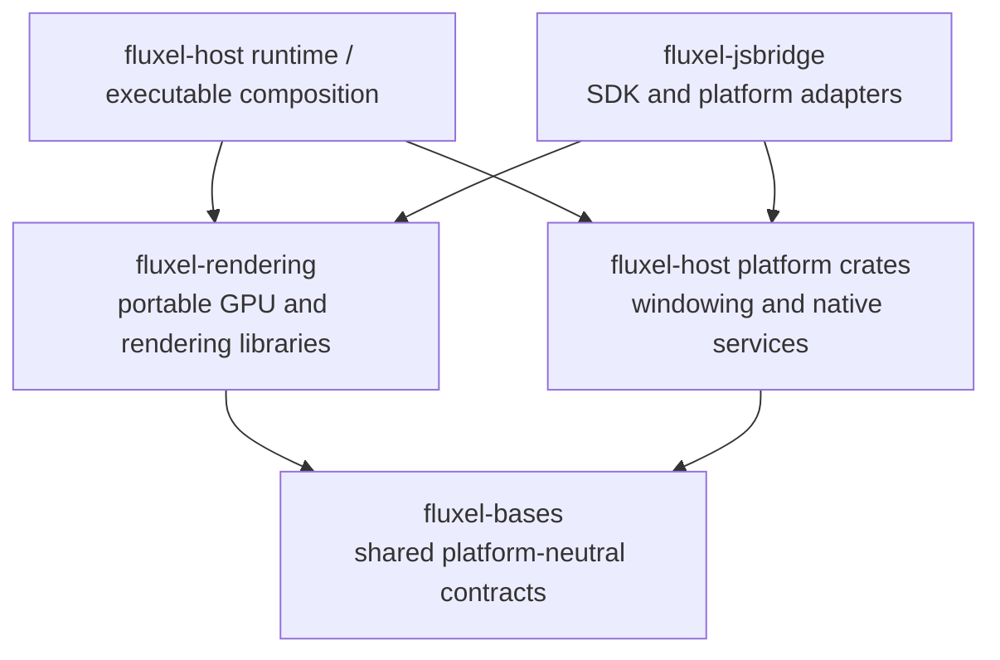
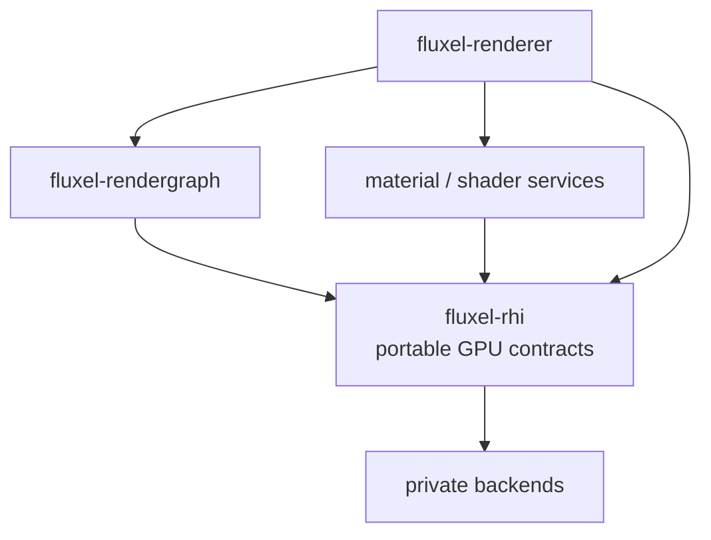

# Fluxel Ecosystem Architecture

This document defines repository, crate, and dependency ownership. It does not
define API semantics, plan order, or delivery status: those belong to the
owning repository's contract documents and [ROADMAP.md](ROADMAP.md),
respectively.

Fluxel has four existing monorepositories: `fluxel-bases`, `fluxel-rendering`,
`fluxel-host`, and `fluxel-jsbridge`. Candidate crates reserve a coherent home;
they are extracted only when an authorized vertical slice proves the boundary.

## Repository dependency direction



`fluxel-bases` is the dependency leaf: it never imports rendering, host, SDK,
or application policy. `fluxel-rendering` never imports host or JS bridge.
`fluxel-host` has two levels: its reusable platform crates may depend on bases
but not rendering; the host repository's runtime and executable-composition
layer may compose those platform crates with rendering. This distinction avoids
making a platform abstraction depend on GPU rendering while retaining one
natural place to build EXE, APK/AAB, or IPA artifacts.

`fluxel-jsbridge` is the default JavaScript integration layer, not semantic
authority. Other language SDKs may consume the same lower contracts.

## Rendering ownership and dependency DAG

Rendering is an ownership DAG, not one universal layered arrow. The following
views describe different relationships and must not be read as substitutes for
one another.

### Frame execution

```text
RenderScene
    ↓
FramePipeline
    ↓
RenderGraph
    ↓
Shader / Pipeline + Material Runtime
    ↓
RHI
```

This is the normal frame-execution flow. It does not prescribe crate imports or
require each runtime operation to be forwarded through every preceding box.

### Material compilation

```text
MaterialGraph
    ↓
Material IR
    ↓
Shader System
    ↓
ShaderArtifact / Pipeline Requirements
```

This is a compilation and generation relationship, distinct from selecting a
shader or pipeline and binding a material instance during frame execution.

### Crate and portable-contract dependencies



`fluxel-renderer` consumes material/shader services and `fluxel-rendergraph`.
`fluxel-rendergraph` depends on `fluxel-rhi`. Renderer, RenderGraph, and
shader/material runtime may each use RHI portable contracts directly where
their own ownership requires it. RHI is the shared GPU foundation, not a
layer-by-layer forwarding path; no upper layer may reach backend-private native
APIs or synchronization objects. A material/shader split remains a future
crate-boundary decision.

`fluxel-rendergraph` owns graph-specific semantics: logical resources and
versions, pass access declarations, dependencies, culling, scheduling, and
logical lifetimes. It directly uses the portable RHI vocabulary and capability
facts required for graph compilation and recording. It never touches
backend-private native API or synchronization objects.

`fluxel-rhi` owns the portable GPU contract: device facts, physical resources,
command recording, submission, completion, presentation, allocation
realization, and private backend implementation. `fluxel-renderer` prepares
scenes and GPU residency, resolves material/shader variants, selects a
`FramePipeline`, and builds RenderGraph work.

## Library ownership

Status is structural, not a promise of scope:

- **Existing:** an implemented workspace crate or established internal boundary.
- **Candidate:** a likely independent boundary, not yet a committed crate.
- **Unscheduled:** no currently authorized extraction.

| Library / boundary | Repository | Status | Ownership |
| --- | --- | --- | --- |
| `fluxel-assets` | `fluxel-bases` | Existing | Logical asset identity, typed handles, generations, CPU-side state, reuse, and budgets; never GPU residency or I/O policy |
| `fluxel-base`, `fluxel-diagnostics`, `fluxel-loader`, `fluxel-time`, `fluxel-input` | `fluxel-bases` | Candidate | Shared utilities, diagnostics, loading orchestration, and portable time/input contracts when a vertical slice proves each boundary |
| `fluxel-image` | `fluxel-bases` | Unscheduled | Owned pixel data and portable image codecs |
| `fluxel-rhi` | `fluxel-rendering` | Existing | Portable GPU resources, recording, submission, completion, presentation, and backend realization |
| `fluxel-rendergraph` | `fluxel-rendering` | Existing | Graph IR, pass/resource dependencies, validation, scheduling, and virtual-resource lifetime |
| `fluxel-renderer` | `fluxel-rendering` | Existing | RenderScene preparation, FramePipeline SPI, visibility/culling/sorting, material and draw preparation, and rendering integration |
| rendering asset residency | `fluxel-rendering` | Existing internal boundary | Persistent GPU realization keyed by logical asset and device generation, upload, recreation, last-use tracking, and retirement |
| `fluxel-shader` | `fluxel-rendering` | Candidate | Shader assembly, reflection, variants, artifacts, and caching, extracted only when its authorized vertical slice proves the boundary |
| `fluxel-canvas` | `fluxel-rendering` | Candidate | Canvas 2D and minimal text after its authorized slice |
| `fluxel-ui` | `fluxel-rendering` | Candidate | Purpose-built declarative UI after Canvas, text, input, and lifecycle evidence |
| `fluxel-rendering-abi` | `fluxel-rendering` | Unscheduled | Stable native binary packaging boundary |
| `fluxel-rendering-wasm` | `fluxel-rendering` | Existing | WASM packaging and exports for rendering |
| `fluxel-platform` | `fluxel-host` | Existing internal boundary | Platform lifecycle, windows, display handles, and native-service composition without rendering dependency |
| `fluxel-fs`, `fluxel-storage`, `fluxel-net`, `fluxel-audio`, `fluxel-video`, `fluxel-native-time`, `fluxel-native-input`, `fluxel-diagnostic-sinks` | `fluxel-host` | Unscheduled | Native platform services, extracted only for a demonstrated reusable consumer |
| `fluxel-vm-js`, `fluxel-native-bridge` | `fluxel-host` | Unscheduled | Native language-runtime integration |
| host runtime / executable composition | `fluxel-host` | Existing internal boundary | Composition of platform crates and rendering into native deliverables |
| `fluxel-adapter-browser` | `fluxel-jsbridge` | Existing | Browser APIs, WASM loading, lifecycle adaptation, and browser diagnostics |
| `fluxel-js-sdk`, `fluxel-adapter-minigame` | `fluxel-jsbridge` | Candidate | Public JavaScript API and selected mini-game adaptation; SDK core extraction requires an established Rust contract and one real adapter, not a fixed adapter count |
| `fluxel-adapter-native` | `fluxel-jsbridge` | Unscheduled | JavaScript adaptation over native-host bridge contracts |

## Ownership rules

- Bases owns logical identities and portable contracts. Rendering owns their
  GPU realization. Host and JS bridge own platform acquisition and sinks.
- RenderGraph transient resources are not assets. Persistent GPU residency is
  not a base asset system. These are separate lifetime domains.
- A host window supplies standard display/window handles. RHI creates and owns
  the native surface, swapchain, presentation, GPU synchronization, and GPU
  lifetime derived from those handles.
- Host platform crates do not import rendering. Only host runtime composition
  may link or load rendering.
- JS adapters may translate canvas/surface lifecycle, resize, and loss/restore,
  but do not expose or own backend-private GPU objects.
- Canvas and UI consume prepared rendering resources; they do not introduce
  DOM, CSS, or third-party compatibility contracts.

The authoritative RHI, RenderGraph, renderer, and capture/replay contracts are
maintained in `fluxel-rendering`. This map assigns their ownership only.
